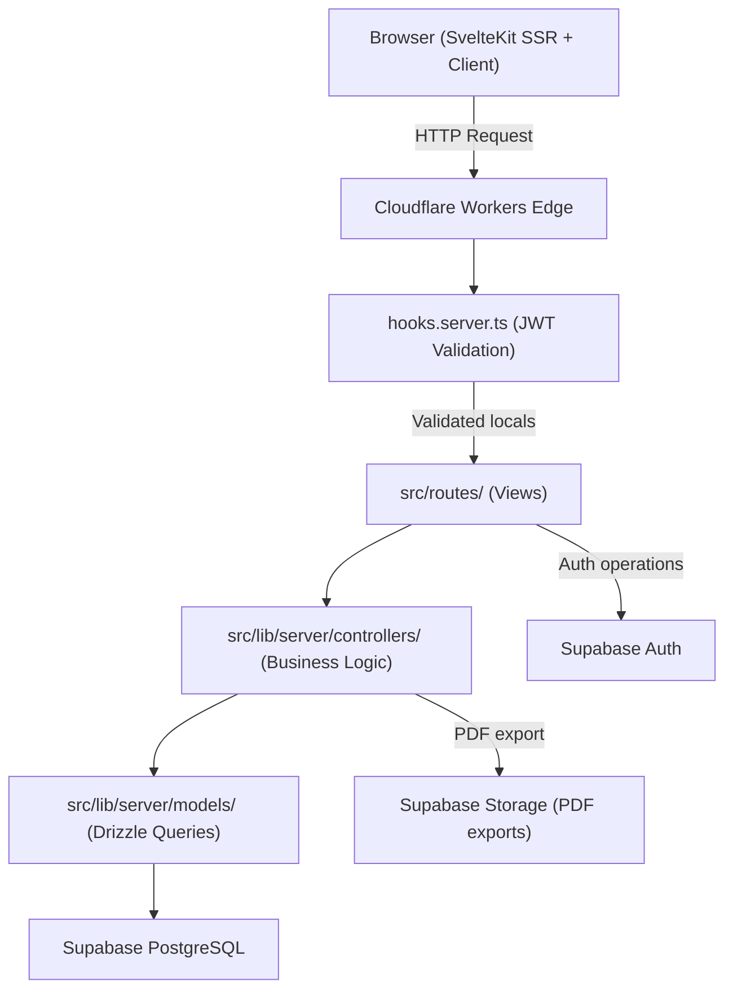

# Design Document: Jhaerin Tire Supply Inventory Management System (JTIMS)

## Overview

JTIMS is a full-stack inventory management web application for Jhaerin Tire Supply, built with SvelteKit deployed on Cloudflare Workers. It follows an MVC architecture where SvelteKit route files act as Views, `src/lib/server/models/` files act as Models (Drizzle ORM queries), and `src/lib/server/controllers/` files act as Controllers (business logic). The system manages tire products, stock movements, sales, financial analytics, user accounts, and notifications — all secured by Supabase Auth JWT tokens validated on every server request.

The application targets two user roles:
- **Owner** — full access including User Management, Financial Analytics, Settings, and Data Management
- **Staff** — access to Inventory, Stock, Sales, Dashboard, and Notifications

### Key Design Decisions

1. **Cloudflare Workers + Supabase PostgreSQL**: The SvelteKit Cloudflare adapter runs the app at the edge. Database access goes through Drizzle ORM with a `postgres-js` client connecting to Supabase PostgreSQL via `DATABASE_URL`. The existing `src/lib/server/db/index.ts` singleton is the only database connection point.

2. **JWT-based RBAC in `hooks.server.ts`**: Every request is intercepted, the Supabase JWT is validated, and `userId`, `email`, and `role` are attached to `event.locals`. Route-level guards in `+page.server.ts` files check `locals.role` for Owner-only routes.

3. **Superforms for all forms**: All user-facing forms use `sveltekit-superforms` with `zod` schemas defined in `src/lib/schemas/`. This provides both client-side and server-side validation with a single schema definition.

4. **shadcn-svelte for modals**: Create/edit operations use `Dialog` or `Sheet` components; destructive confirmations (archive, delete, deactivate) use `AlertDialog` components.

5. **LayerChart for visualizations**: All charts (bar, line, pie/donut) use LayerChart, which is SvelteKit-native and D3-based.

6. **Atomic database transactions**: All operations that touch multiple tables (Stock-In, Stock-Out, Sales) use Drizzle ORM transactions to guarantee consistency.

---

## Architecture



### Request Lifecycle

```mermaid
sequenceDiagram
    participant Client
    participant hooks.server.ts
    participant +page.server.ts
    participant Controller
    participant Model
    participant DB

    Client->>hooks.server.ts: HTTP Request
    hooks.server.ts->>hooks.server.ts: Validate JWT (Supabase)
    alt JWT invalid/expired
        hooks.server.ts-->>Client: Redirect /login (401)
    else JWT valid
        hooks.server.ts->>+page.server.ts: event.locals = {userId, email, role}
        +page.server.ts->>+page.server.ts: Check role for Owner-only routes
        +page.server.ts->>Controller: Call controller function
        Controller->>Model: Execute Drizzle query
        Model->>DB: SQL via postgres-js
        DB-->>Model: Result
        Model-->>Controller: Typed result
        Controller-->>+page.server.ts: Processed data
        +page.server.ts-->>Client: PageData / Form response
    end
```

### MVC Folder Structure

```
src/
├── routes/
│   ├── (auth)/
│   │   ├── login/
│   │   │   ├── +page.svelte
│   │   │   └── +page.server.ts
│   │   └── register/
│   │       ├── +page.svelte
│   │       └── +page.server.ts
│   ├── dashboard/
│   │   ├── +page.svelte
│   │   └── +page.server.ts
│   ├── inventory/
│   │   ├── +page.svelte
│   │   └── +page.server.ts
│   ├── sales/
│   │   ├── +page.svelte
│   │   └── +page.server.ts
│   ├── stock/
│   │   ├── +page.svelte          (Stock-In + Stock-Out tabs)
│   │   └── +page.server.ts
│   ├── reports/
│   │   ├── +page.svelte
│   │   └── +page.server.ts
│   ├── users/
│   │   ├── +page.svelte
│   │   └── +page.server.ts
│   └── settings/
│       ├── +page.svelte
│       └── +page.server.ts
├── lib/
│   ├── server/
│   │   ├── db/
│   │   │   ├── index.ts          (Drizzle singleton)
│   │   │   └── schema.ts         (All table definitions)
│   │   ├── models/
│   │   │   ├── inventory.ts
│   │   │   ├── sales.ts
│   │   │   ├── stock.ts
│   │   │   └── users.ts
│   │   ├── controllers/
│   │   │   ├── inventory.ts
│   │   │   ├── sales.ts
│   │   │   └── auth.ts
│   │   └── auth/
│   │       └── jwt.ts
│   ├── components/
│   │   ├── ui/                   (shadcn-svelte components)
│   │   └── modals/               (feature-specific modal wrappers)
│   ├── schemas/                  (Superforms/Zod schemas)
│   └── utils/
└── hooks.server.ts
```

---

## Components and Interfaces

### Authentication (`src/lib/server/auth/jwt.ts`)

```typescript
// Validates a Supabase JWT and returns decoded claims
function validateJWT(token: string): Promise<JWTClaims | null>

// Extracts role from Supabase user metadata custom claims
function extractRole(payload: JWTPayload): 'Owner' | 'Staff'

interface JWTClaims {
  userId: string;
  email: string;
  role: 'Owner' | 'Staff';
  exp: number;
  iat: number;
}
```

### `hooks.server.ts`

The global server hook intercepts every request:
1. Reads the Supabase session cookie
2. Calls `supabase.auth.getSession()` to validate and optionally refresh the JWT
3. On success: populates `event.locals.user` with `{ userId, email, role }`
4. On failure: redirects to `/login`
5. Checks `event.locals.user.role === 'Owner'` for Owner-only route prefixes (`/users`, `/reports`, `/settings`, `/financial`)

### Models (Drizzle Query Layer)

Each model file exports typed query functions. No business logic lives here — only database reads and writes.

**`src/lib/server/models/inventory.ts`**
```typescript
getProducts(filters: ProductFilters): Promise<Product[]>
getProductById(id: string): Promise<Product | null>
insertProduct(data: NewProduct): Promise<Product>
updateProduct(id: string, data: Partial<Product>): Promise<Product>
archiveProduct(id: string): Promise<void>
```

**`src/lib/server/models/stock.ts`**
```typescript
insertStockIn(tx: DrizzleTransaction, data: NewStockIn): Promise<StockIn>
updateStockIn(tx: DrizzleTransaction, id: string, data: Partial<StockIn>): Promise<StockIn>
deleteStockIn(tx: DrizzleTransaction, id: string): Promise<void>
insertStockOut(tx: DrizzleTransaction, data: NewStockOut): Promise<StockOut>
updateStockOut(tx: DrizzleTransaction, id: string, data: Partial<StockOut>): Promise<StockOut>
deleteStockOut(tx: DrizzleTransaction, id: string): Promise<void>
adjustProductQuantity(tx: DrizzleTransaction, productId: string, delta: number): Promise<void>
```

**`src/lib/server/models/sales.ts`**
```typescript
insertSale(tx: DrizzleTransaction, data: NewSale): Promise<Sale>
updateSale(tx: DrizzleTransaction, id: string, data: Partial<Sale>): Promise<Sale>
deleteSale(tx: DrizzleTransaction, id: string): Promise<void>
getSales(filters: SaleFilters): Promise<Sale[]>
getSalesSummary(dateRange: DateRange): Promise<SalesSummary>
```

**`src/lib/server/models/users.ts`**
```typescript
getUserById(id: string): Promise<User | null>
getUsers(filters: UserFilters): Promise<User[]>
insertUser(data: NewUser): Promise<User>
updateUser(id: string, data: Partial<User>): Promise<User>
logActivity(userId: string, action: string): Promise<void>
```

### Controllers (Business Logic Layer)

**`src/lib/server/controllers/inventory.ts`**
```typescript
// Validates uniqueness, calls model, triggers low-stock notification check
createProduct(data: NewProductInput): Promise<Result<Product>>

// Validates, updates, rechecks low-stock threshold
updateProduct(id: string, data: UpdateProductInput): Promise<Result<Product>>

// Checks for active references before archiving
archiveProduct(id: string): Promise<Result<void>>
```

**`src/lib/server/controllers/sales.ts`**
```typescript
// Computes revenue, cost, grossProfit; validates quantity; runs DB transaction
createSale(data: CreateSaleInput): Promise<Result<Sale>>

// Recomputes financials; runs DB transaction
updateSale(id: string, data: UpdateSaleInput): Promise<Result<Sale>>

// Restores quantity; runs DB transaction
deleteSale(id: string): Promise<Result<void>>

// Pure computation — no DB access
computeSaleFinancials(
  quantitySold: number,
  costPrice: number,
  retailPrice: number
): { revenue: number; cost: number; grossProfit: number }

// Computes profit margin percentage
computeProfitMargin(grossProfit: number, revenue: number): number

// Computes inventory turnover ratio
computeInventoryTurnover(cogs: number, avgInventoryValue: number): number
```

**`src/lib/server/controllers/auth.ts`**
```typescript
// Wraps Supabase Auth Admin API for Owner-only user management
createStaffAccount(email: string, password: string, role: string): Promise<Result<User>>
updateStaffAccount(userId: string, updates: StaffUpdates): Promise<Result<User>>
deactivateStaffAccount(userId: string): Promise<Result<void>>
deleteStaffAccount(userId: string): Promise<Result<void>>
```

### Superforms Schemas (`src/lib/schemas/`)

All schemas use Zod and are shared between client and server via Superforms:

```typescript
// schemas/product.ts
const productSchema = z.object({
  brand: z.string().min(1),
  size: z.string().min(1),
  pattern: z.string().min(1),
  quantity: z.number().int().min(0),
  costPrice: z.number().positive(),
  retailPrice: z.number().positive(),
  deliveryProvider: z.string().min(1),
  lowStockThreshold: z.number().int().min(0)
});

// schemas/sale.ts
const saleSchema = z.object({
  productId: z.string().uuid(),
  quantitySold: z.number().int().min(1)
});

// schemas/stockIn.ts
const stockInSchema = z.object({
  productId: z.string().uuid(),
  quantity: z.number().int().min(1),
  deliveryProvider: z.string().min(1),
  date: z.date()
});

// schemas/stockOut.ts
const stockOutSchema = z.object({
  productId: z.string().uuid(),
  quantity: z.number().int().min(1),
  reason: z.string().min(1),
  date: z.date()
});
```

### UI Components

**Modal components** (`src/lib/components/modals/`):
- `ProductFormModal.svelte` — Dialog wrapping create/edit product form
- `StockInFormModal.svelte` — Dialog for Stock-In add/edit
- `StockOutFormModal.svelte` — Dialog for Stock-Out add/edit
- `SaleFormModal.svelte` — Dialog for sale create/edit
- `ConfirmDeleteModal.svelte` — AlertDialog for destructive confirmations
- `UserFormModal.svelte` — Dialog for create/edit staff
- `DeliveryProviderModal.svelte` — Dialog for delivery provider CRUD
- `NotificationModal.svelte` — Dialog for notification detail and dismiss-all
- `ReportExportModal.svelte` — Dialog for PDF export configuration

**Dashboard charts** (LayerChart):
- `SalesBarChart.svelte` — daily/weekly/monthly sales volume
- `RevenueProfitLineChart.svelte` — revenue and gross profit trends
- `SalesByCategoryPieChart.svelte` — breakdown by brand/category

---

## Data Models

### Database Schema (`src/lib/server/db/schema.ts`)

```typescript
import {
  pgTable, uuid, text, integer, numeric, timestamp,
  boolean, pgEnum, uniqueIndex, index
} from 'drizzle-orm/pg-core';

// Enums
export const roleEnum = pgEnum('role', ['Owner', 'Staff']);
export const notificationStatusEnum = pgEnum('notification_status', ['unread', 'read', 'dismissed']);
export const notificationTypeEnum = pgEnum('notification_type', ['low_stock', 'dead_stock', 'system']);

// users — mirrors Supabase Auth users, stores role for RBAC
export const users = pgTable('users', {
  id: uuid('id').primaryKey(),                    // matches Supabase Auth user.id
  email: text('email').notNull().unique(),
  role: roleEnum('role').notNull().default('Staff'),
  createdAt: timestamp('created_at').defaultNow().notNull(),
  updatedAt: timestamp('updated_at').defaultNow().notNull()
});

// deliveryProviders — configurable list managed in Settings
export const deliveryProviders = pgTable('delivery_providers', {
  id: uuid('id').primaryKey().defaultRandom(),
  name: text('name').notNull().unique(),
  createdAt: timestamp('created_at').defaultNow().notNull()
});

// products — core inventory catalog
export const products = pgTable('products', {
  id: uuid('id').primaryKey().defaultRandom(),
  brand: text('brand').notNull(),
  size: text('size').notNull(),
  pattern: text('pattern').notNull(),
  quantity: integer('quantity').notNull().default(0),
  costPrice: numeric('cost_price', { precision: 12, scale: 2 }).notNull(),
  retailPrice: numeric('retail_price', { precision: 12, scale: 2 }).notNull(),
  deliveryProvider: text('delivery_provider').notNull(),
  lowStockThreshold: integer('low_stock_threshold').notNull().default(5),
  isArchived: boolean('is_archived').notNull().default(false),
  createdAt: timestamp('created_at').defaultNow().notNull(),
  updatedAt: timestamp('updated_at').defaultNow().notNull()
}, (t) => ({
  brandSizePatternUnique: uniqueIndex('products_brand_size_pattern_unique')
    .on(t.brand, t.size, t.pattern),
  brandIdx: index('products_brand_idx').on(t.brand),
  sizeIdx: index('products_size_idx').on(t.size)
}));

// stockIn — incoming inventory transactions
export const stockIn = pgTable('stock_in', {
  id: uuid('id').primaryKey().defaultRandom(),
  productId: uuid('product_id').notNull().references(() => products.id),
  quantity: integer('quantity').notNull(),
  deliveryProvider: text('delivery_provider').notNull(),
  date: timestamp('date').notNull(),
  createdAt: timestamp('created_at').defaultNow().notNull()
}, (t) => ({
  dateIdx: index('stock_in_date_idx').on(t.date),
  productIdx: index('stock_in_product_idx').on(t.productId)
}));

// stockOut — outgoing inventory transactions
export const stockOut = pgTable('stock_out', {
  id: uuid('id').primaryKey().defaultRandom(),
  productId: uuid('product_id').notNull().references(() => products.id),
  quantity: integer('quantity').notNull(),
  reason: text('reason').notNull(),
  date: timestamp('date').notNull(),
  createdAt: timestamp('created_at').defaultNow().notNull()
}, (t) => ({
  dateIdx: index('stock_out_date_idx').on(t.date),
  productIdx: index('stock_out_product_idx').on(t.productId)
}));

// sales — sales transactions with computed financials
export const sales = pgTable('sales', {
  id: uuid('id').primaryKey().defaultRandom(),
  productId: uuid('product_id').notNull().references(() => products.id),
  quantitySold: integer('quantity_sold').notNull(),
  revenue: numeric('revenue', { precision: 12, scale: 2 }).notNull(),
  cost: numeric('cost', { precision: 12, scale: 2 }).notNull(),
  grossProfit: numeric('gross_profit', { precision: 12, scale: 2 }).notNull(),
  date: timestamp('date').notNull(),
  createdAt: timestamp('created_at').defaultNow().notNull()
}, (t) => ({
  dateIdx: index('sales_date_idx').on(t.date),
  productIdx: index('sales_product_idx').on(t.productId)
}));

// notifications — low-stock, dead-stock, and system alerts
export const notifications = pgTable('notifications', {
  id: uuid('id').primaryKey().defaultRandom(),
  userId: uuid('user_id').notNull().references(() => users.id),
  type: notificationTypeEnum('type').notNull(),
  message: text('message').notNull(),
  status: notificationStatusEnum('status').notNull().default('unread'),
  createdAt: timestamp('created_at').defaultNow().notNull()
});

// activityLogs — audit trail for Owner-visible user actions
export const activityLogs = pgTable('activity_logs', {
  id: uuid('id').primaryKey().defaultRandom(),
  userId: uuid('user_id').notNull().references(() => users.id),
  action: text('action').notNull(),
  createdAt: timestamp('created_at').defaultNow().notNull()
});

// settings — system-wide configuration (single row)
export const settings = pgTable('settings', {
  id: uuid('id').primaryKey().defaultRandom(),
  globalLowStockThreshold: integer('global_low_stock_threshold').notNull().default(5),
  deadStockDays: integer('dead_stock_days').notNull().default(90),
  theme: text('theme').notNull().default('dark'),
  dateFormat: text('date_format').notNull().default('MM/DD/YYYY'),
  defaultReportDateRange: text('default_report_date_range').notNull().default('30d'),
  updatedAt: timestamp('updated_at').defaultNow().notNull()
});
```

### TypeScript Types

```typescript
// Inferred from Drizzle schema
type Product = typeof products.$inferSelect;
type NewProduct = typeof products.$inferInsert;
type StockIn = typeof stockIn.$inferSelect;
type Sale = typeof sales.$inferSelect;
type User = typeof users.$inferSelect;
type Notification = typeof notifications.$inferSelect;

// Controller result wrapper
type Result<T> = { success: true; data: T } | { success: false; error: string };

// Computed financial types
interface SaleFinancials {
  revenue: number;
  cost: number;
  grossProfit: number;
}

interface FinancialSummary {
  totalRevenue: number;
  totalCost: number;
  totalGrossProfit: number;
  profitMarginPercent: number;
}
```

### App.Locals Extension

`src/app.d.ts` must be extended to type `event.locals`:

```typescript
declare global {
  namespace App {
    interface Locals {
      user: {
        userId: string;
        email: string;
        role: 'Owner' | 'Staff';
      } | null;
    }
    interface Platform {
      env: Env;
      ctx: ExecutionContext;
      caches: CacheStorage;
    }
  }
}
```

---

## Correctness Properties

*A property is a characteristic or behavior that should hold true across all valid executions of a system — essentially, a formal statement about what the system should do. Properties serve as the bridge between human-readable specifications and machine-verifiable correctness guarantees.*

This system is primarily CRUD + UI + infrastructure. However, the financial computation functions in `src/lib/server/controllers/sales.ts` are pure functions with clear input/output behavior and universal properties that hold across all valid inputs. These are the appropriate targets for property-based testing.

The property-based testing library used is **fast-check** (TypeScript/JavaScript).

### Property 1: Sale financial computation is internally consistent

*For any* positive `quantitySold`, positive `costPrice`, and positive `retailPrice`, the computed `revenue` must equal `quantitySold × retailPrice`, `cost` must equal `quantitySold × costPrice`, and `grossProfit` must equal `revenue − cost`.

**Validates: Requirements 9.2**

### Property 2: Profit margin is bounded and consistent

*For any* sale where `revenue > 0`, the computed profit margin percentage `(grossProfit / revenue) × 100` must be a finite number, and when `retailPrice > costPrice` the margin must be positive, when `retailPrice < costPrice` the margin must be negative, and when `retailPrice === costPrice` the margin must be zero.

**Validates: Requirements 12.1**

### Property 3: Stock quantity adjustment is reversible

*For any* product with a given `quantity`, applying a positive delta (Stock-In) followed by the same negative delta (Stock-Out or deletion) must return the product to its original `quantity`.

**Validates: Requirements 7.1, 7.4, 8.1, 8.5**

### Property 4: Stock-Out quantity guard

*For any* product with `quantity = q` and any attempted Stock-Out of `amount > q`, the operation must be rejected and the product quantity must remain `q`.

**Validates: Requirements 8.2**

### Property 5: Sale quantity guard

*For any* product with `quantity = q` and any attempted sale of `amount > q`, the operation must be rejected and neither a sale record nor a quantity change must occur.

**Validates: Requirements 9.4**

---

## Error Handling

### Strategy

All controller functions return a `Result<T>` discriminated union rather than throwing exceptions. Route `+page.server.ts` files unwrap results and return appropriate Superforms `fail()` responses or redirect on success.

```typescript
// Controller pattern
async function createSale(input: CreateSaleInput): Promise<Result<Sale>> {
  if (input.quantitySold <= 0) {
    return { success: false, error: 'Quantity must be greater than zero' };
  }
  try {
    const result = await db.transaction(async (tx) => { /* ... */ });
    return { success: true, data: result };
  } catch (err) {
    return { success: false, error: 'Database error. Please try again.' };
  }
}
```

### Error Categories

| Category | Handling |
|---|---|
| Validation errors (Zod/Superforms) | Returned as field-level errors via `fail(400, { form })` |
| Business rule violations (insufficient stock, duplicate product) | Returned as form-level errors via `fail(422, { form })` |
| Database transaction failures | Rolled back automatically; controller returns `{ success: false }` |
| Authentication failures | `hooks.server.ts` redirects to `/login` with 401 |
| Authorization failures (wrong role) | `hooks.server.ts` returns 403 |
| Supabase Auth Admin API errors | Caught in `auth.ts` controller; returned as descriptive error strings |
| PDF export / Supabase Storage errors | Caught in analytics controller; user shown error toast |

### Transaction Rollback Pattern

All multi-table operations use Drizzle's `db.transaction()`:

```typescript
await db.transaction(async (tx) => {
  await insertStockIn(tx, stockInData);
  await adjustProductQuantity(tx, productId, +quantity);
  // If either throws, Drizzle rolls back both operations
});
```

### Password Reset Privacy

Per Requirement 1.7, the password reset endpoint always returns a generic confirmation message regardless of whether the email exists, preventing user enumeration.

---

## Testing Strategy

### Overview

This system uses a dual testing approach:
- **Unit tests** (Vitest, server project): Pure business logic functions, controller computations, validation helpers
- **Property-based tests** (fast-check + Vitest, server project): Financial computation functions and quantity guard logic
- **Component tests** (Vitest browser project with Playwright): Svelte component rendering and interaction
- **Integration tests**: Form action flows tested via SvelteKit's `+page.server.ts` with mocked Drizzle client

PBT is scoped to the pure computation functions in `src/lib/server/controllers/sales.ts` and the quantity adjustment logic in `src/lib/server/models/stock.ts`. CRUD operations, UI rendering, and infrastructure (Supabase Auth, Cloudflare Workers) are covered by example-based unit tests and integration tests.

### Property-Based Tests

Using **fast-check** (`npm install --save-dev fast-check`). Each property test runs a minimum of **100 iterations**.

```typescript
// src/lib/server/controllers/sales.spec.ts
import fc from 'fast-check';
import { describe, it, expect } from 'vitest';
import { computeSaleFinancials, computeProfitMargin } from './sales';

describe('Sale financial computations', () => {
  // Feature: jhaerin-tire-inventory, Property 1: Sale financial computation is internally consistent
  it('revenue = qty × retail, cost = qty × cost, grossProfit = revenue - cost', () => {
    fc.assert(
      fc.property(
        fc.integer({ min: 1, max: 10000 }),
        fc.float({ min: 0.01, max: 99999.99, noNaN: true }),
        fc.float({ min: 0.01, max: 99999.99, noNaN: true }),
        (qty, costPrice, retailPrice) => {
          const result = computeSaleFinancials(qty, costPrice, retailPrice);
          expect(result.revenue).toBeCloseTo(qty * retailPrice, 2);
          expect(result.cost).toBeCloseTo(qty * costPrice, 2);
          expect(result.grossProfit).toBeCloseTo(result.revenue - result.cost, 2);
        }
      ),
      { numRuns: 100 }
    );
  });

  // Feature: jhaerin-tire-inventory, Property 2: Profit margin is bounded and consistent
  it('profit margin sign matches price relationship', () => {
    fc.assert(
      fc.property(
        fc.float({ min: 0.01, max: 99999.99, noNaN: true }),
        fc.float({ min: 0.01, max: 99999.99, noNaN: true }),
        fc.integer({ min: 1, max: 10000 }),
        (costPrice, retailPrice, qty) => {
          const { revenue, grossProfit } = computeSaleFinancials(qty, costPrice, retailPrice);
          const margin = computeProfitMargin(grossProfit, revenue);
          expect(isFinite(margin)).toBe(true);
          if (retailPrice > costPrice) expect(margin).toBeGreaterThan(0);
          if (retailPrice < costPrice) expect(margin).toBeLessThan(0);
          if (retailPrice === costPrice) expect(margin).toBeCloseTo(0, 5);
        }
      ),
      { numRuns: 100 }
    );
  });
});
```

### Unit Tests

- **Auth controller**: Test JWT claim extraction, role mapping, error cases for invalid tokens
- **Inventory controller**: Test duplicate detection logic, archive guard (active references), validation error paths
- **Sales controller**: Test quantity guard (sale > stock rejected), transaction rollback simulation
- **Stock controller**: Test Stock-Out quantity guard, delta calculation for edits and deletes
- **Notification service**: Test low-stock threshold trigger logic, status transition rules
- **Financial engine**: Test inventory turnover formula, monthly summary aggregation

### Component Tests (Vitest Browser + Playwright)

- Modal open/close behavior for `ProductFormModal`, `ConfirmDeleteModal`
- Superforms client-side validation feedback rendering
- Dashboard KPI card rendering with mock data
- LayerChart rendering with empty and populated datasets

### Integration Tests

- Full form action flows: create product → verify DB insert (mocked Drizzle)
- Stock-In transaction: verify both `stockIn` insert and `products.quantity` increment
- Sales transaction: verify `sales` insert, `products.quantity` decrement, and financial field values
- `hooks.server.ts`: verify redirect on missing JWT, 403 on wrong role, locals population on valid JWT

### Test Commands

```bash
# Run all tests (single pass, no watch)
npm run test

# Run only server-side tests
npx vitest run --project server

# Run only browser/component tests
npx vitest run --project client
```
